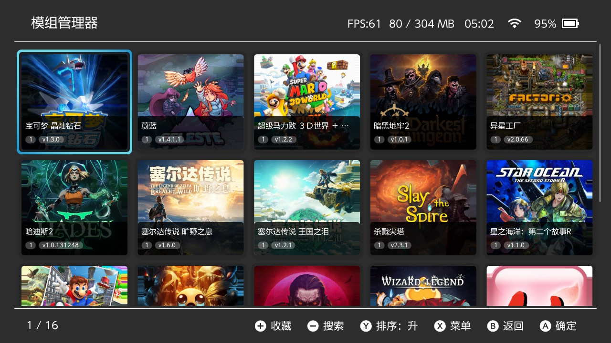
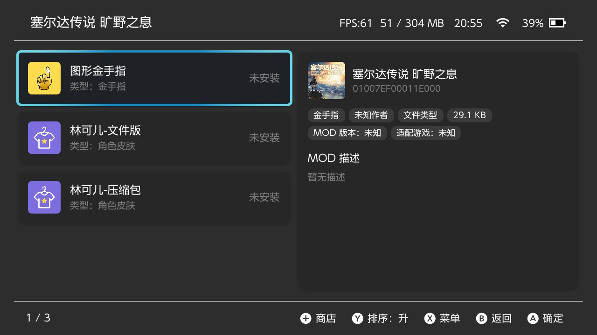
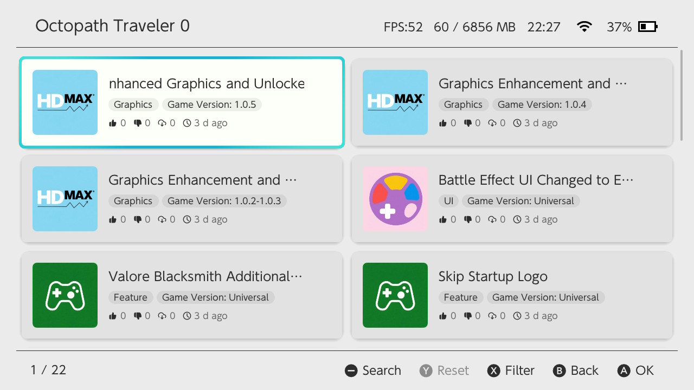
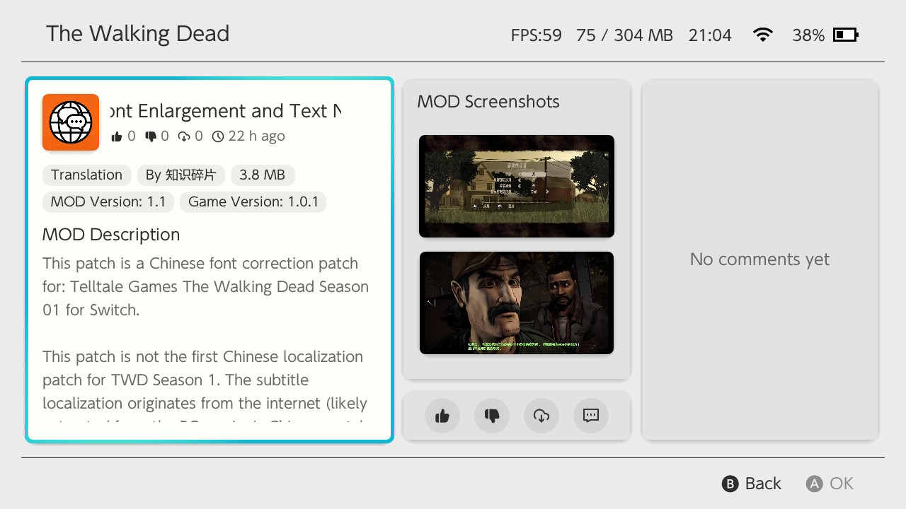

<div align="center">
  <br>

  <h1>NX Mod Manager</h1>

[](https://www.bilibili.com/video/BV1zd5o6wE5B/)
[](https://github.com/TOM-BadEN/NX-Mod-Manager/releases/latest)
[](https://somsubhra.github.io/github-release-stats/?username=TOM-BadEN&repository=NX-Mod-Manager&page=1&per_page=300)
[](https://hb-app.store/switch/NXModManager)
[](https://PayPal.me/TomSun666)
[](https://github.com/TOM-BadEN/NX-Mod-Manager/blob/main/.github/forReadme/WeChat%20Pay.png)

<p><a href="./README.md">中文</a>&nbsp;&nbsp;&nbsp;&nbsp;<a href="./README_EN.md">English</a></p>

</div>

## About

&emsp;&emsp;A mod management tool designed specifically for the Nintendo Switch platform. The current version features a complete code rewrite and underlying architecture redesign, with significant improvements in both functionality and stability. The project is fully open-source and permanently free, with no paid content of any kind. It supports online browsing and downloading of mods, and provides a complete on-device management workflow, allowing mod acquisition and management without manually handling the SD card. The development and maintenance of online mod resources relies on the participation and contribution of the community.

> [!WARNING]
> &emsp;&emsp;Monster Hunter serial number adaptation is not yet supported. This feature will be implemented in the next version.

## Features

<div align="center">

| Feature | Description |
| --- | --- |
| Game Management | Add games from installed game list or by manually entering TID; supports game removal and favorites |
| Mod Management | Add, install, uninstall, and remove mods; compatible with both ZIP archives and folder formats |
| Patch Conversion | Automatically converts pchtxt text patches to IPS patches during mod installation |
| Smart Detection | Automatically identifies mod files with non-standard directory structures and detects file conflicts between mods |
| Smart Search | Supports pinyin, polyphone, initials, fuzzy matching and other search methods, deeply adapted for Chinese users |
| Mod Toggle | One-click disable or restore all mods for quick game issue troubleshooting |
| File Transfer | Supports MTP (USB wired) and FTP (Wi-Fi wireless) for transferring mods to the console |
| Online Store | Built-in mod store with browsing, searching, downloading and uploading; includes like and comment features |
| Customization | Customize various content such as game name, mod name, description, version, author, and type |
| Multi-language | Simplified Chinese, Traditional Chinese, and English interfaces |
| Theme Switching | Light and dark themes with automatic system-following option |
| Auto Update | Check and download new versions within the app |
| Force Cleanup | Fix reference count corruption caused by abnormal interruptions |

</div>

## User Notice

> [!WARNING]
> &emsp;&emsp;The current version features a complete code rewrite and underlying architecture redesign. Due to significant architectural changes, data from older versions cannot be migrated and is incompatible with version 2.x — reconfiguration is required after upgrading. Due to the unique mod mechanism on the Switch platform, mods cannot run completely independently of each other, and no manager can avoid the impact of external operations. While using this manager, manually operating the SD card or mixing other managers for mod installation and uninstallation may cause internal data to become invalid, resulting in residual files during uninstallation. It is recommended to completely uninstall all mods previously installed via manual methods, the 2.x version manager, or other third-party managers before use to ensure a clean environment.

> [!CAUTION]
> &emsp;&emsp;This project is independently maintained by an individual. The author is not a professional developer and cannot guarantee the software is free of defects. Risks such as game save corruption or mod file damage during use are borne by the user. The server and website are also maintained by the author alone, and long-term stable operation cannot be guaranteed. However, this project will never charge any fees. If maintenance can no longer continue in the future, the server and related data will be transferred to a willing maintainer. If any user-uploaded mod content infringes on the legitimate rights of the original author, please contact the author promptly, and the content will be removed immediately upon verification.

> [!NOTE]
> &emsp;&emsp;Due to limited personal capacity, the author cannot independently collect and upload a large number of mod resources. The content of the online mod store relies on community participation and maintenance. If you have quality mod resources, you are welcome to share them with other users through the web upload feature. Please obtain authorization from the original author before uploading. If the resource originates from someone else's post, please include the original link for traceability. Uploading paid, pornographic, or other prohibited and sensitive content is strictly forbidden. Such content will be removed immediately upon discovery, and the associated account may be permanently banned.

## Screenshots

<div align="center">
  <br>
  <br>
  <br>
  
</div>

## Usage

&emsp;&emsp;Please [click here](https://github.com/TOM-BadEN/NX-Mod-Manager/releases/latest) to download the latest .nro file and install it on your SD card. For detailed usage instructions, please [click here](https://www.bilibili.com/video/BV1zd5o6wE5B/) to watch the video tutorial, or view the basic tutorial within the app under "About".

## Feedback

&emsp;&emsp;Please submit feedback primarily through GitHub [Issues](https://github.com/TOM-BadEN/NX-Mod-Manager/issues). You can also find other feedback channels within the app under "About". Regardless of the method used, please provide as complete and accurate information as possible. Due to limited personal capacity, feedback with incomplete information or vague descriptions may not receive follow-up inquiries. It is recommended to include: Atmosphere and system firmware version, detailed steps to trigger the issue, whether the issue is consistently reproducible, relevant files if the issue only occurs with specific files, and any other information that may help identify the problem.

## Building

**Requirements:**
- devkitPro
- Ninja

**Build Commands:**

```bash
make          # Build the project
make debug    # Debug build + nxlink send
make clean    # Clean build directory
```

## Special Notes

> [!CAUTION]
> &emsp;&emsp;The server is personally maintained by the author, and the file contains all backend API endpoint addresses. The high operational costs and limited capacity mean that exposing the API addresses would risk abuse and malicious attacks. Therefore, the [`url.hpp`](https://github.com/TOM-BadEN/NX-Mod-Manager/blob/main/code/include/api/url.hpp.example) file in this project is not included in the open-source scope. The project can be compiled and used directly, but online-related features will be unavailable. For full network functionality, please set up your own backend service and fill in the corresponding API addresses.

## Acknowledgments

Thanks to the following open-source projects:

<div align="center">

| Project | Description | Author |
| --- | --- | --- |
| [borealis](https://github.com/xfangfang/borealis) | UI Framework | [xfangfang](https://github.com/xfangfang) [natinusala](https://github.com/natinusala)|
| [libhaze](https://github.com/Atmosphere-NX/Atmosphere/tree/master/troposphere/haze) | MTP | [ITotalJustice](https://github.com/ITotalJustice) |
| [ftpsrv](https://github.com/ITotalJustice/ftpsrv) | FTP | [ITotalJustice](https://github.com/ITotalJustice) |
| [yyjson](https://github.com/ibireme/yyjson) | High-performance JSON parsing | [ibireme](https://github.com/ibireme) |
| [cpp-pinyin](https://github.com/wolfgitpr/cpp-pinyin) | Pinyin search | [wolfgitpr](https://github.com/wolfgitpr) |
| [QR-Code-generator](https://github.com/nayuki/QR-Code-generator) | QR code generation | [nayuki](https://github.com/nayuki) |
| [miniz](https://github.com/richgel999/miniz) | ZIP compression & decompression | [richgel999](https://github.com/richgel999) |
| [libnxtc](https://github.com/DarkMatterCore/libnxtc) | Game info caching | [DarkMatterCore](https://github.com/DarkMatterCore) |
| \ | Issue assistance | [masagrator](https://github.com/masagrator) |
| \ | Hundreds of original MODs | [明月清风](https://www.tekqart.com/space-uid-2878778.html) |
| \ | Extensive NS game data | [时鹏亮](https://shipengliang.com/about-us) |

</div>

## License

This project is licensed under [GPL-2.0](LICENSE).
